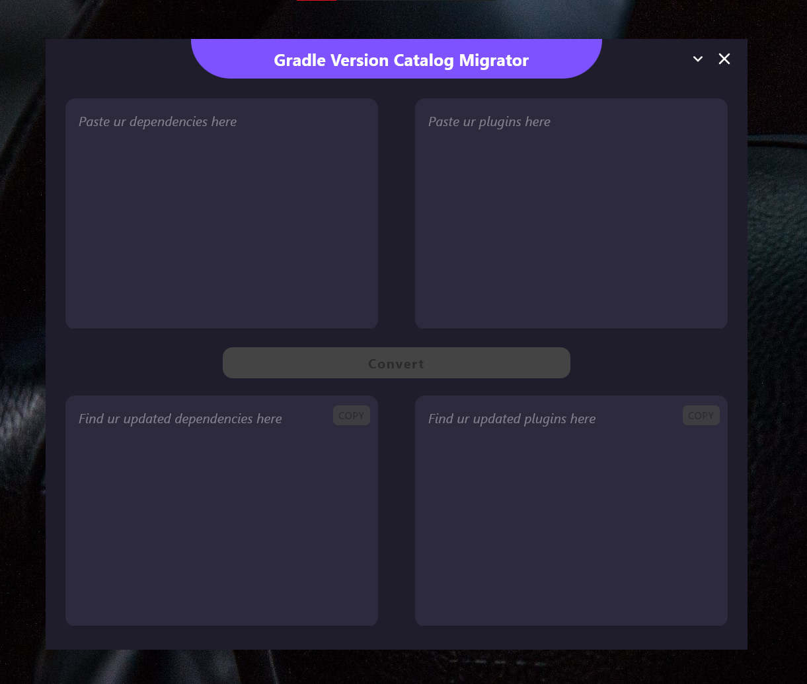
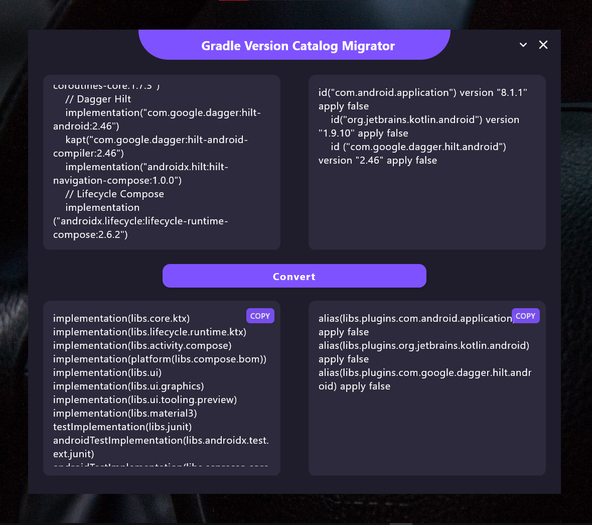

&nbsp;&nbsp;

&nbsp;&nbsp;

# Gradle Version Catalog Migrator

Experience seamless Gradle Version Catalog migration across all types of desktop powered by **Compose for Desktop**!
Effortlessly manage and update your Gradle dependencies with a single, unified solution designed for compatibility and efficiency across major desktop platforms.

## Working 💻

https://github.com/its-me-debk007/gradle-version-catalog-migrator/assets/81604986/0da5dc77-0282-4ba2-9bd1-4b9317ef5fae

- Just copy-paste your dependencies & plugins
- `libs.versions.toml` file will be generated inside the output folder
- Paste the generated dependencies & plugins to their respected files
- Add `@Suppress("DSL_SCOPE_VIOLATION")` to the top of module & root level build.gradle.kts, and `true` to the end of the root level build.gradle.kts

## Preview 👀

|                  Preview 1                   |                  Preview 2                   |
|:--------------------------------------------:|:--------------------------------------------:|
|  |  |

## How to Build and Run the App 🛠️

- Clone this repository to your local machine
- Open the project in your preferred Kotlin Multiplatform IDE (e.g. IntelliJ IDEA)
- Build the project and then run it

## Contributing 🤝

Join us in shaping the future of this project – your contributions are invaluable!

- **Fork the repository** and create a new branch for your feature or bug fix
- Select an existing issue or create a new one, and request that it be assigned
- If the issue is assigned, make your changes and ensure that the code follows the project's coding standards
- Write tests to cover your changes and ensure that existing tests pass
- Submit a **pull request**, explaining the changes and the problem it addresses
- A project maintainer will review your pull request, and upon approval, it will be merged into the main branch

## License 📜

Distributed under the MIT License. See `LICENSE` file for more information.

### 🌟 If you find value in this project, please consider starring it! Your support keeps it thriving 🚀
